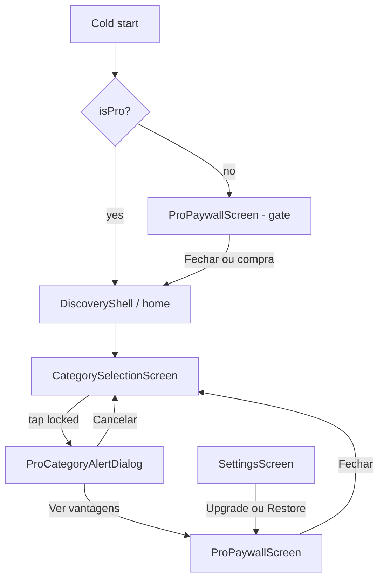

# RevenueCat / Monetização Pro — Design

**Spec**: `.specs/features/revenuecat-monetization/spec.md`  
**Status**: Approved  
**Decisões**: D1–D13 (ver spec § Decisões de produto)  
**Bundle IDs**: `com.mathsquirrels.outoftheloop`

---

## Architecture Overview



**Regra de ouro:** `GameFlowController` e `LocalContentRepository` não importam RevenueCat. Gating só antes de `onContinue(category)`.

---

## Navigation & paywall gate (D10)

### Comportamento

| Momento | Free | Pro |
| --- | --- | --- |
| Cold start | `initialLocation` → paywall gate | `initialLocation` → `home` |
| Fechar paywall gate | `go(home)`; flag `paywallGateDismissed = true` na sessão | N/A |
| Próximo cold start | Paywall gate de novo | `home` |
| Tap categoria bloqueada | Alerta → opcional paywall | `matchSetup` |
| Settings → Upgrade | `push(proPaywall)` | — |
| Settings → Restaurar | `restore()` + snackbar | idem |

### GoRouter

- Paywall gate: rota **raiz** `AppRoutes.proPaywall`, **fora** de `StatefulShellRoute` / `DiscoveryShell`.
- `redirect` no `GoRouter`:

```dart
redirect: (context, state) {
  if (subscription.isPro) return null;
  if (subscription.paywallGateDismissed) return null;
  if (state.matchedLocation == AppRoutes.proPaywall) return null;
  // Opcional: permitir deep links de jogo sem gate — fora do escopo v1
  return AppRoutes.proPaywall;
},
```

- `initialLocation`: `AppRoutes.proPaywall` se `!isPro && !dismissed`, senão `AppRoutes.home`.
- Após `Purchases` + cache carregar, `refreshListenable` no router reavalia redirect (evita flash Pro→Free).

### `ProPaywallScreen` modos

| Modo | AppBar | Fechar |
| --- | --- | --- |
| `gate` (abertura) | X no canto superior | `onDismiss` → `go(home)` + `markGateDismissed()` |
| `presented` (alerta, settings) | X | `pop()` para tela anterior |

Ambos os modos: planos + **Restaurar compras** + legal.

---

## RevenueCat & Store Catalog

| Recurso | ID | Notas |
| --- | --- | --- |
| Entitlement | `pro` | Mensal, anual e vitalício concedem o mesmo entitlement |
| Offering | `default` | **Current** |
| Package monthly | `monthly` | `otl_pro_monthly` — auto-renewable subscription |
| Package annual | `annual` | `otl_pro_annual` — auto-renewable + **7-day free trial** (lojas) |
| Package lifetime | `lifetime` | `otl_pro_lifetime` — non-consumable (iOS) / one-time (Play) |

### Trial e desconto (D1, D2)

- **Trial 7 dias:** configurar no App Store Connect (Introductory Offer) e Google Play (free trial) no produto **anual** apenas. O app exibe copy localizada; a cobrança é enforced pela loja.
- **Desconto anual:** definir preço anual < 12 × mensal nas lojas. No paywall:
  - Plano anual como **recomendado** (badge).
  - Exibir economia percentual quando `annualPrice < monthlyPrice * 12` (cálculo no app a partir de `StoreProduct`).

### Plataforma

- **iOS:** In-App Purchase capability; subscription group para mensal + anual.
- **Android:** `BILLING` no manifest; base plans para assinaturas.

---

## ProAccessPolicy (D3, D4)

```dart
final class ProAccessPolicy {
  const ProAccessPolicy({
    this.freeCategoryIds = kDefaultFreeCategoryIds,
  });

  /// Aprovado em D4 — alterar só com decisão de produto.
  static const kDefaultFreeCategoryIds = {
    'food',
    'movies',
    'sports',
  };

  final Set<String> freeCategoryIds;

  bool isPlayable(String categoryId, {required bool isPro}) =>
      isPro || freeCategoryIds.contains(categoryId);

  bool requiresPro(String categoryId, {required bool isPro}) =>
      !isPlayable(categoryId, isPro: isPro);

  int get lockedCategoryCount => 20 - freeCategoryIds.length; // 17
}
```

Arquivo: `lib/src/domain/services/pro_access_policy.dart`.

---

## Cache & offline (D6)

Persistir em `SharedPreferences` após cada `CustomerInfo` válido:

| Chave | Tipo | Uso |
| --- | --- | --- |
| `sub_is_pro` | bool | Fonte offline |
| `sub_expiration_ms` | int? | Assinaturas; null para vitalício |
| `sub_updated_ms` | int | Auditoria |

| Cenário | Comportamento |
| --- | --- |
| Cache `isPro == true`, rede falha | **Pro** — não rebaixar |
| Cache `isPro == false`, rede falha | Free |
| Sem cache, rede falha | Free |
| Rede OK | `getCustomerInfo()` sobrescreve cache |

Vitalício: `expirationDate == null` e entitlement `pro` active → cache `isPro: true` sem expiração.

---

## Modules

```text
lib/src/
  domain/
    models/subscription_status.dart
    services/pro_access_policy.dart
  data/subscriptions/
    subscription_repository.dart
    revenue_cat_subscription_repository.dart
    subscription_cache.dart
  app/
    subscription_controller.dart
    subscription_scope.dart
  features/pro/
    pro_paywall_screen.dart
    widgets/pro_plan_card.dart
    widgets/pro_paywall_hero.dart
```

### `SubscriptionController`

- `init`: ler cache → emitir status → `refresh()` se possível.
- `CustomerInfo` listener para updates pós-compra.
- `offerings` cache para paywall.
- `purchasePackage(Package)` / `restore()`.

### `ProPaywallScreen` (D5 — custom v1)

Layout (Figma `2:625` + tokens OTL):

1. **Fechar (X)** — canto superior; sempre visível (gate e presented).
2. Hero + headline (“Desbloqueie todas as categorias”).
3. Bullets: “17 categorias extras”, “Jogue offline”, etc.
4. **Três cards**: anual (recomendado + trial 7d + % economia), mensal, vitalício.
5. CTA primário no plano selecionado (default: anual).
6. **Restaurar compras** — botão dedicado, sempre visível (D13); não esconder atrás de menu.
7. Legal + Termos/Privacidade.

Extrair `restorePurchases()` para método compartilhado usado pelo paywall e Settings (`SubscriptionController.restore()`).

Não usar `purchases_ui_flutter` na v1.

---

## Category grid & alert (RC-02, D11, D12)

### Cadeado (D12)

`OtlCategoryTile` com `locked: true`:

```text
Stack(
  children: [
    // card existente
    Positioned(
      top: 8,
      left: 8,
      child: Icon(Icons.lock, ...), // ou asset OTL
    ),
  ],
)
```

- Posição: **top-left**, padding consistente com borda brutalist (8–12px).
- Não centralizar o cadeado; não usar overlay full-card que obscureça o label.

### Alerta ao tocar bloqueada (D11)

`showProCategoryAlert(context)` → `AlertDialog` / `OtlBrutalistDialog` (se existir padrão):

| Ação | Comportamento |
| --- | --- |
| Cancelar | `Navigator.pop` do dialog apenas |
| Ver vantagens Pro | `pop` dialog → `push(proPaywall, extra: presented)` |

Copy l10n (exemplo):

- Título: “Categoria Pro”
- Corpo: “Esta categoria faz parte do Out of the Loop Pro. Quer ver o que você desbloqueia?”
- Cancelar / Ver vantagens

**Proibido:** `push(paywall)` direto no `onTap` da categoria bloqueada.

### Fluxo free playable

Tap free → `onContinue(category)` inalterado.

---

## Settings (RC-04, D13)

Seção **PRO** acima de About:

| Estado | Elementos |
| --- | --- |
| Free | CTA “Desbloquear Pro” → paywall; **Restaurar compras** |
| Pro | Status “Você é Pro”; Gerenciar assinatura (se `managementURL`); **Restaurar compras** |

**Restaurar compras** em Configurações é **obrigatório** para Free e Pro (reinstalação, troca de aparelho, assinatura não refletida).

Feedback: `SnackBar` ou dialog com `proRestoreSuccess`, `proRestoreEmpty`, `proRestoreError`.

---

## Bootstrap

```dart
// main.dart
WidgetsFlutterBinding.ensureInitialized();
await Purchases.configure(
  PurchasesConfiguration(
    Platform.isIOS ? iosKey : androidKey,
  ),
);
```

Chaves: `RC_IOS_KEY`, `RC_ANDROID_KEY` via `--dart-define`.

---

## Routing

| Rota | Constante | Widget | Notas |
| --- | --- | --- | --- |
| Paywall gate | `AppRoutes.proPaywall` | `ProPaywallScreen(mode: gate)` | Cold start Free; fullscreen |
| Paywall modal | `AppRoutes.proPaywall` | `ProPaywallScreen(mode: presented)` | Após alerta ou Settings |

Query/extra: `source=gate|category|settings`.

`SubscriptionController`:

- `bool paywallGateDismissed` — só memória (sessão).
- `void markPaywallGateDismissed()`.
- `Future<RestoreResult> restore()` — único entry point para paywall + settings.

---

## Dependencies

```yaml
dependencies:
  purchases_flutter: ^8.0.0  # pin na T01 após pub resolve
```

Sem `purchases_ui_flutter` na v1.

---

## Testing

| Teste | Alvo |
| --- | --- |
| `pro_access_policy_test.dart` | 3 playable free; 17 require pro; pro unlocks all |
| `subscription_cache_test.dart` | read/write; pro preserved offline |
| `otl_category_tile_test.dart` | lock icon top-left when locked |
| `pro_category_alert_test.dart` | cancel stays; confirm opens paywall route |
| Manual | Sandbox: monthly, annual+trial, lifetime, restore |

Gate: `flutter analyze && flutter test`.

---

## Implementation Phases

Ver `tasks.md` — Phases 1–3 mapeiam RC-01 a RC-04.

---

## Open Technical (não bloqueiam v1)

1. Banner billing retry — confiar no RC apenas na v1.
2. `isPremium` no JSON — P2; lista fixa na v1.
3. Family Sharing — RC trata; sem UI extra.
