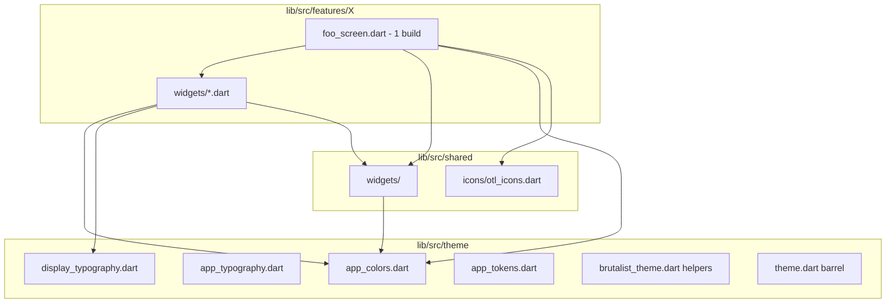

# Consolidação de UI — Design

**Spec**: `.specs/features/ui-consolidation/spec.md`  
**Tipo**: Refatoração estrutural (brownfield)  
**Sem mudança de comportamento de produto**

---

## Architecture Overview



---

## Color Consolidation Strategy

### Phase A — Alias, não redesign

1. Criar `app_colors.dart` com seções:
   - `AppColors` — manter nomes existentes usados por `OutOfTheLoopTheme`.
   - `BrutalistColors` — mover definições de `brutalist_theme.dart` para cá (ou typedef/static forwarding).
2. `brutalist_theme.dart` reexporta ou delega:
   ```dart
   // brutalist_theme.dart — após migração
   export 'app_colors.dart' show BrutalistColors;
   ```
3. Substituir literais nas features por token mais próximo semanticamente.
4. Gate: `rg 'Color\(0x' lib/src/features lib/src/shared` → 0.

### Mapping table (initial)

| Literal / uso atual | Token alvo |
| --- | --- |
| Fundo `#111125` | `BrutalistColors.screenBackground` |
| Card `#1E1E32` | `BrutalistColors.cardBackground` |
| Lime `#B7F700` | `BrutalistColors.lime` |
| Magenta acentos jogo | `AppColors.secondaryMain` ou brutalist equivalente documentado |

Valores hex **não mudam** nesta feature; apenas o endereço de import.

---

## Typography Strategy

| Caso de uso | API |
| --- | --- |
| App shell legado, forms genéricos | `AppTypography` / `Theme.of(context).textTheme` |
| Telas discovery / brutalist / jogo recente | `DisplayTypography.*` com `color: AppColors...` |
| Estilo repetido 2+ vezes | Novo preset em `display_typography.dart` |

Proibido após migração: `GoogleFonts.rubik(...)` inline em arquivos de feature.

---

## Icons Strategy

```text
lib/src/shared/icons/
  otl_icons.dart       # Nav, actions, settings rows
features/setup/
  category_icon.dart   # Domain: Category → IconData (permanece até 2º consumidor)
```

`OtlIcons` exemplos:

```dart
abstract final class OtlIcons {
  static const home = Icons.home_outlined;
  static const settings = Icons.settings_outlined;
  // ...
}
```

Tamanho e cor default via helpers opcionais em `OtlIcon` widget se repetido — só se T07 identificar padrão.

---

## Screen / Widget Extraction Pattern

### Before

```dart
// voting_screen.dart — anti-pattern
class VotingScreen extends StatefulWidget { ... }

class _VotingHeadline extends StatelessWidget {
  @override
  Widget build(BuildContext context) => ...;
}
// ... mais 8 classes
```

### After

```dart
// voting_screen.dart
class VotingScreen extends StatefulWidget { ... }

class _VotingScreenState extends State<VotingScreen> {
  @override
  Widget build(BuildContext context) {
    return Scaffold(
      body: Stack(
        children: [
          const VotingAtmosphere(),
          // composição apenas
        ],
      ),
    );
  }
}
```

```dart
// widgets/voting_headline.dart
class VotingHeadline extends StatelessWidget {
  const VotingHeadline({ ... });
  @override
  Widget build(BuildContext context) => ...;
}
```

### Naming

| Antes (privado) | Depois (público no arquivo) |
| --- | --- |
| `_VotingHeadline` | `VotingHeadline` |
| `_ShadowedText` (duplicado) | `OtlShadowedText` em shared |

Widgets locais permanecem **públicos** no arquivo dedicado (sem `_` no tipo) para facilitar testes e hot reload.

### CustomPainter

`_DashedBorderPainter` em `question_round_screen` → `widgets/question_card_dashed_border.dart` ou co-locado com `QuestionCard`.

---

## Shared Widget Candidates (confirmed duplicates)

| Widget privado | Destino | Tasks |
| --- | --- | --- |
| `_ShadowedText` | `otl_shadowed_text.dart` | T06 |
| `_TimerExpiredMessage` | `otl_timer_expired_message.dart` | T07 |
| `_BrutalistToggle` | `otl_brutalist_toggle.dart` | T06 |
| `*Atmosphere` (5 variantes) | `otl_party_atmosphere.dart` ou variantes nomeadas | T08 |

---

## Folder Layout Per Feature

```text
features/game/
  voting_screen.dart
  widgets/
    voting_atmosphere.dart
    voting_headline.dart
    voting_player_card.dart
    ...

features/setup/
  player_setup_screen.dart
  widgets/                    # já existe — estender
    otl_category_tile.dart
    otl_player_tile.dart
    player_setup_header.dart
    ...
```

---

## Import Conventions

```dart
// Preferido em features
import '../../../theme/theme.dart';
import '../../../shared/widgets/shared_widgets.dart';
import 'widgets/voting_headline.dart';
```

Evitar import circular: `shared/widgets` **não** importa `features/`.

---

## Testing Impact

| Mudança | Ação de teste |
| --- | --- |
| Move widget, mesmo UI | Testes de tela devem passar sem alteração |
| Renomear tipo público | Atualizar apenas se test importar tipo diretamente |
| Novo shared widget | Opcional: widget test mínimo em `test/shared/widgets/` |
| Tokens | Atualizar `test/theme` se existir; senão gate analyze |

---

## Migration Order (dependency-safe)

1. Theme/colors barrel (bloqueia remoção de literais)
2. Typography presets + icons barrel
3. Shared deduplication (desbloqueia telas que copiam os mesmos widgets)
4. Screen extractions em paralelo por arquivo
5. Docs + full gate

---

## Baseline Audit (T01 — 2026-05-19)

Auditoria mecânica do repositório antes da Fase 1 (tema). Comando de contagem: `grep -r 'Color(0x' --include='*.dart'`.

### Tabela de literais `Color(0x` por arquivo

| Arquivo | Ocorrências | Zona | Migrar em |
| --- | ---: | --- | --- |
| `lib/src/theme/app_tokens.dart` | 29 | theme (canônico) | T02 — mover cores para `app_colors.dart` |
| `lib/src/theme/brutalist_theme.dart` | 20 | theme (canônico) | T02 — delegar a `app_colors.dart` |
| `lib/src/features/game/round_results_screen.dart` | 9 | features | T16 |
| `lib/src/features/game/voting_screen.dart` | 7 | features | T15 |
| `lib/src/features/game/final_leaderboard_screen.dart` | 4 | features | T17 |
| `lib/src/features/how_to_play/how_to_play_screen.dart` | 4 | features | T19 |
| `lib/src/features/settings/settings_screen.dart` | 3 | features | T10 |
| `lib/src/shared/widgets/otl_home_backdrop.dart` | 2 | shared | T06/T18 (home) |
| `lib/src/features/game/secret_reveal_screen.dart` | 1 | features | T13 |
| `lib/src/features/game/question_round_screen.dart` | 1 | features | T14 |
| `lib/src/features/setup/player_setup_screen.dart` | 1 | features | T12 |
| `test/theme/app_tokens_test.dart` | 4 | test | manter (asserts de token) |

**Totais**

| Zona | Ocorrências |
| --- | ---: |
| `lib/src/theme/` | 49 |
| `lib/src/features/` | 30 |
| `lib/src/shared/` | 2 |
| `test/` (fora de theme) | 0 |
| **Fora de theme (alvo → 0)** | **32** |

Gate de sucesso da feature: `grep` em `lib/src/features` + `lib/src/shared` → 0 ocorrências.

### Inventário de widgets privados por tela

Contagem: classes `class _*` com `build` em `*_screen.dart` (exclui `*ScreenState`). Linhas via `wc -l` em 2026-05-19.

| Tela | Arquivo | Linhas | Privados (audit) | Spec | `build` no arquivo | Notas |
| --- | --- | ---: | ---: | ---: | ---: | --- |
| Category selection | `category_selection_screen.dart` | 136 | 1 | 1 | 2 | `_CategoryHeader` |
| Home | `home_screen.dart` | 144 | 2 | 2 | 3 | `_HomeHeroTitle`, `_TitleLines` |
| How to play | `how_to_play_screen.dart` | 234 | 2 | 2 | 3 | `_RuleCard`, `_KaPowBanner` |
| Final leaderboard | `final_leaderboard_screen.dart` | 419 | 4 | 4 | 5 | |
| Secret reveal | `secret_reveal_screen.dart` | 490 | 8 | 8 | 9 | incl. `_SecretRevealAtmosphere` |
| Settings | `settings_screen.dart` | 522 | 8 | 8 | 9 | incl. `_BrutalistToggle` |
| Match setup | `match_setup_screen.dart` | 605 | 7 | 7 | 8 | incl. `_MatchSetupAtmosphere` |
| Player setup | `player_setup_screen.dart` | 626 | 5 | 5 | 6 | incl. `_PlayerSetupAtmosphere`; pasta `widgets/` já existe |
| Question round | `question_round_screen.dart` | 732 | 9 + painter | 10 | 10 | `_DashedBorderPainter` (sem `build`); conta como 10 na spec |
| Round results | `round_results_screen.dart` | 751 | 9 | 10 | 11 | **Dois screens no mesmo arquivo**: `RoundResultsScreen` + `GuessScreen` |
| Voting | `voting_screen.dart` | 775 | 9 | 9 | 10 | |

**Duplicatas confirmadas (shared — Fase 2)**

| Símbolo privado | Arquivos |
| --- | --- |
| `_ShadowedText` | `voting_screen.dart`, `round_results_screen.dart` |
| `_TimerExpiredMessage` | `voting_screen.dart`, `question_round_screen.dart` |
| `_BrutalistToggle` | `settings_screen.dart` (único; candidato a `OtlBrutalistToggle`) |
| `*Atmosphere` | 5 telas: voting, question_round, secret_reveal, match_setup, player_setup |

**Outros sinais**

- `GoogleFonts.*` inline em `lib/src/features/`: **0** (já centralizado em `DisplayTypography`).
- `Icons.*` em features: ~54 usos em 11 arquivos; `category_icon.dart` concentra 21 (domínio setup).
- `lib/src/features/setup/widgets/`: padrão alvo já iniciado (`otl_category_tile.dart`, `otl_player_tile.dart`).

### Convenção “1 build por screen”

**Regra (UIC-18):** o widget público da tela (`FooScreen` / `_FooScreenState`) expõe **exatamente um** `build` que compõe layout (Scaffold, listeners, navegação). Subcomponentes com `build` próprio vivem em `features/<feature>/widgets/<snake_case>.dart`.

**Estado atual:** nenhuma tela do inventário cumpre a regra; todas acumulam 2–11 métodos `build` no mesmo arquivo.

**Exceções documentadas**

1. `CustomPainter` e helpers sem `build` podem ficar no arquivo do consumidor ou em `widgets/` se > ~40 linhas (`_DashedBorderPainter` em question round).
2. `round_results_screen.dart` hospeda **dois** screens (`RoundResultsScreen`, `GuessScreen`) — T16 deve extrair `GuessScreen` para arquivo próprio ou subpasta antes/durante extração de widgets.

Detalhes de import, naming e promoção para `shared/`: ver secções acima e `.specs/codebase/CONVENTIONS.md`.

---

## Decisions Log

| Data | Decisão | Razão |
| --- | --- | --- |
| 2026-05-19 | Baseline de 32 literais fora de `theme/` | T01 audit; gate da feature |
| 2026-05-19 | Atmosphere: **5** variantes nomeadas (`*Atmosphere`) | Diff visual pendente em T08; não assumir pixel-identical |
| 2026-05-19 | `category_icon.dart` permanece em `features/setup/` até T05 | 21/54 usos de `Icons.` no setup; sem 2º consumidor cross-feature hoje |
| 2026-05-19 | `round_results` + `GuessScreen` no mesmo arquivo | T16 trata como split de screen + extração de widgets |
| 2026-05-19 | `theme.dart` barrel; cores em `app_colors.dart` | T02–T03 |
| 2026-05-19 | `OtlIcons` + barrel `shared/icons/icons.dart` | T05; nav/app bars/home backdrop migrados |
| 2026-05-19 | `category_icon.dart` permanece em `features/setup/` | T05 — domínio; reexport futuro se cross-feature |
| 2026-05-19 | Atmosphere: **1 widget**, 4 named constructors (match + player share `matchSetup`) | T08 — layouts differ; parameterized single file preserves pixels |
