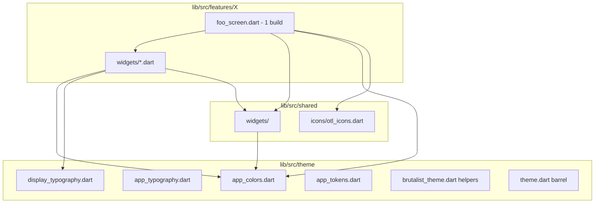

# Consolidação de UI — Design

**Spec**: `.specs/features/ui-consolidation/spec.md`  
**Tipo**: Refatoração estrutural (brownfield)  
**Sem mudança de comportamento de produto**

---

## Architecture Overview



---

## Color Consolidation Strategy

### Phase A — Alias, não redesign

1. Criar `app_colors.dart` com seções:
   - `AppColors` — manter nomes existentes usados por `OutOfTheLoopTheme`.
   - `BrutalistColors` — mover definições de `brutalist_theme.dart` para cá (ou typedef/static forwarding).
2. `brutalist_theme.dart` reexporta ou delega:
   ```dart
   // brutalist_theme.dart — após migração
   export 'app_colors.dart' show BrutalistColors;
   ```
3. Substituir literais nas features por token mais próximo semanticamente.
4. Gate: `rg 'Color\(0x' lib/src/features lib/src/shared` → 0.

### Mapping table (initial)

| Literal / uso atual | Token alvo |
| --- | --- |
| Fundo `#111125` | `BrutalistColors.screenBackground` |
| Card `#1E1E32` | `BrutalistColors.cardBackground` |
| Lime `#B7F700` | `BrutalistColors.lime` |
| Magenta acentos jogo | `AppColors.secondaryMain` ou brutalist equivalente documentado |

Valores hex **não mudam** nesta feature; apenas o endereço de import.

---

## Typography Strategy

| Caso de uso | API |
| --- | --- |
| App shell legado, forms genéricos | `AppTypography` / `Theme.of(context).textTheme` |
| Telas discovery / brutalist / jogo recente | `DisplayTypography.*` com `color: AppColors...` |
| Estilo repetido 2+ vezes | Novo preset em `display_typography.dart` |

Proibido após migração: `GoogleFonts.rubik(...)` inline em arquivos de feature.

---

## Icons Strategy

```text
lib/src/shared/icons/
  otl_icons.dart       # Nav, actions, settings rows
features/setup/
  category_icon.dart   # Domain: Category → IconData (permanece até 2º consumidor)
```

`OtlIcons` exemplos:

```dart
abstract final class OtlIcons {
  static const home = Icons.home_outlined;
  static const settings = Icons.settings_outlined;
  // ...
}
```

Tamanho e cor default via helpers opcionais em `OtlIcon` widget se repetido — só se T07 identificar padrão.

---

## Screen / Widget Extraction Pattern

### Before

```dart
// voting_screen.dart — anti-pattern
class VotingScreen extends StatefulWidget { ... }

class _VotingHeadline extends StatelessWidget {
  @override
  Widget build(BuildContext context) => ...;
}
// ... mais 8 classes
```

### After

```dart
// voting_screen.dart
class VotingScreen extends StatefulWidget { ... }

class _VotingScreenState extends State<VotingScreen> {
  @override
  Widget build(BuildContext context) {
    return Scaffold(
      body: Stack(
        children: [
          const VotingAtmosphere(),
          // composição apenas
        ],
      ),
    );
  }
}
```

```dart
// widgets/voting_headline.dart
class VotingHeadline extends StatelessWidget {
  const VotingHeadline({ ... });
  @override
  Widget build(BuildContext context) => ...;
}
```

### Naming

| Antes (privado) | Depois (público no arquivo) |
| --- | --- |
| `_VotingHeadline` | `VotingHeadline` |
| `_ShadowedText` (duplicado) | `OtlShadowedText` em shared |

Widgets locais permanecem **públicos** no arquivo dedicado (sem `_` no tipo) para facilitar testes e hot reload.

### CustomPainter

`_DashedBorderPainter` em `question_round_screen` → `widgets/question_card_dashed_border.dart` ou co-locado com `QuestionCard`.

---

## Shared Widget Candidates (confirmed duplicates)

| Widget privado | Destino | Tasks |
| --- | --- | --- |
| `_ShadowedText` | `otl_shadowed_text.dart` | T06 |
| `_TimerExpiredMessage` | `otl_timer_expired_message.dart` | T07 |
| `_BrutalistToggle` | `otl_brutalist_toggle.dart` | T06 |
| `*Atmosphere` (5 variantes) | `otl_party_atmosphere.dart` ou variantes nomeadas | T08 |

---

## Folder Layout Per Feature

```text
features/game/
  voting_screen.dart
  widgets/
    voting_atmosphere.dart
    voting_headline.dart
    voting_player_card.dart
    ...

features/setup/
  player_setup_screen.dart
  widgets/                    # já existe — estender
    otl_category_tile.dart
    otl_player_tile.dart
    player_setup_header.dart
    ...
```

---

## Import Conventions

```dart
// Preferido em features
import '../../../theme/theme.dart';
import '../../../shared/widgets/shared_widgets.dart';
import 'widgets/voting_headline.dart';
```

Evitar import circular: `shared/widgets` **não** importa `features/`.

---

## Testing Impact

| Mudança | Ação de teste |
| --- | --- |
| Move widget, mesmo UI | Testes de tela devem passar sem alteração |
| Renomear tipo público | Atualizar apenas se test importar tipo diretamente |
| Novo shared widget | Opcional: widget test mínimo em `test/shared/widgets/` |
| Tokens | Atualizar `test/theme` se existir; senão gate analyze |

---

## Migration Order (dependency-safe)

1. Theme/colors barrel (bloqueia remoção de literais)
2. Typography presets + icons barrel
3. Shared deduplication (desbloqueia telas que copiam os mesmos widgets)
4. Screen extractions em paralelo por arquivo
5. Docs + full gate

---

## Decisions Log

| Data | Decisão | Razão |
| --- | --- | --- |
| TBD | Atmosphere: 1 vs N widgets | Aguarda diff visual T08 |
| TBD | `category_icon` location | Aguarda auditoria T05 |

Preencher durante execução em `.specs/project/STATE.md` se o arquivo for criado.
